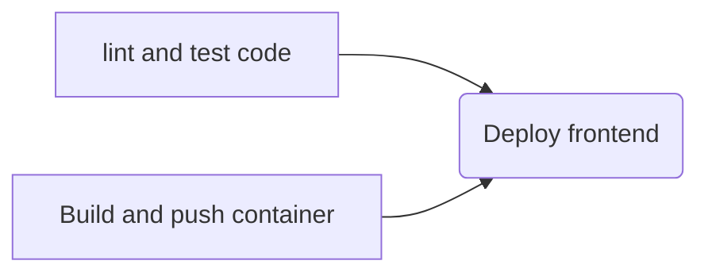

# はじめに

ウェブアプリケーションをクラウドにデプロイして提供する方は複数あります。例えば、S3に静的ファイルを置いて、Cloudfront経由でアクセスするなどがあります。  
昨年にリリースされたAWS App Runnerはコンテナ化されたウェブアプリケーションを提供できるサービスで、ECRにコンテナをPushするだけ、もしくはGitHubのレポジトリを直接つなげるだけで、AWSが提供するLBやVPCを使用して簡単にアプリケーションを提供できます。  

AWSコンソールから簡単に構築できるのが、AWS App Runnerの特徴であり、いいところだと思います。ただ、開発ブランチごとにテストを回すだとか、デプロイが成功することを確認してからメインブランチにマージするとかの検証を行おうと思うと、手動で構築するのは非現実的です。  
そこで、GitHub ActionsとAWS CDKを組み合わせCICDを考慮してAWS App Runnerを使用するものを作ってみたので、紹介しようと思います。  
今回紹介するコードは以下のレポジトリにあります。
https://github.com/shohta-tera/AppRunnerWithCICD/tree/feature/test-commit

## 環境

- Node.js: v16.14.3
- Next.js: 12
- AWS CDK: 2.17.0

## レポジトリ構成

今回のアプリケーションはモノレポで3つのパートに分かれています。
- `.github`: GitHub Actionsの定義が入ったyaml
- `infrastructure`: AWS CDKのファイル群
- `services/web-app`: フロントエンドのファイル群

今回フロントエンドのアプリケーションフレームワークはNext.jsを採用しました。

```
./
├── .github
├── infrastructure
│   ├── bin
│   ├── lib
└── services
    └── web-app
```

## GitHub Actions

GitHub Actionsは主に2つに分けています。
- ECRのデプロイ
- コードのテスト、ビルドおよびApp Runnerのデプロイ。

### GitHub OIDCプロバイダーを用いたAWS CDKの実行

今回AWSへのリソースデプロイにあたり、GitHub OIDCプロバイダーを用いてます。これは、CICD用のIAMユーザーを作ることで、AWSのクレデンシャル情報をGitHubで管理したくないためです。  
GitHub Actionsがassume roleするIAMロールのテンプレートは[公式](https://github.com/aws-actions/configure-aws-credentials)を参考に記載します。

```
Parameters:
  GitHubOrg:
    Type: String
  RepositoryName:
    Type: String
  OIDCProviderArn:
    Description: Arn for the GitHub OIDC Provider.
    Default: ""
    Type: String

Conditions:
  CreateOIDCProvider: !Equals 
    - !Ref OIDCProviderArn
    - ""

Resources:
  Role:
    Type: AWS::IAM::Role
    Properties:
      ManagedPolicyArns: [arn:aws:iam::aws:policy/AdministratorAccess]
      AssumeRolePolicyDocument:
        Statement:
          - Effect: Allow
            Action: sts:AssumeRoleWithWebIdentity
            Principal:
              Federated: !If 
                - CreateOIDCProvider
                - !Ref GithubOidc
                - !Ref OIDCProviderArn
            Condition:
              StringLike:
                token.actions.githubusercontent.com:sub: !Sub repo:${GitHubOrg}/${RepositoryName}:*

  GithubOidc:
    Type: AWS::IAM::OIDCProvider
    Condition: CreateOIDCProvider
    Properties:
      Url: https://token.actions.githubusercontent.com
      ClientIdList: 
        - sts.amazonaws.com
      ThumbprintList:
        - 6938fd4d98bab03faadb97b34396831e3780aea1

Outputs:
  Role:
    Value: !GetAtt Role.Arn 
```
公式からは、ManagedPolicyArnsを追加しています。今回では、`AdministratorAccess`を追加しています。  
AWSコンソールからCloudformationでデプロイする際には、以下のパラメータの入力が必要です。  
- GitHubOrg: Organizationの名前。個人ユーザーの場合は、ユーザー名。
- RepositoryName: 対象のレポジトリ名
- OIDCProviderArn: 空白でも可能。

上記を事前にデプロイした上で、生成されるIAMロールをGitHubのレポジトリのSecretsに格納します。今回の例では、`AWS_ROLE`としています。

### ECRのデプロイ

このGitHub Actionsでは、ECRのデプロイだけでなく、AWS CDKのBootstrapも実行しています。  
そのため、このActionsは初回に実行される必要があります。

:::details GitHub Actionsの全体
```
name: Create base infrastructure

on:
  push:
    paths:
      - "infrastructure/lib/*"
    branches:
      - main
      - develop
  workflow_dispatch:

jobs:
  create_resource:
    runs-on: ubuntu-20.04
    env:
      working-directory: ./infrastructure
      AWS_ROLE_ARN: ${{secrets.AWS_ROLE}}
      AWS_REGION: ap-northeast-1
    permissions:
      id-token: write
      contents: write
    steps:
      - name: Checkout
        uses: actions/checkout@v2
      - name: Setup Node
        uses: actions/setup-node@v1
        with:
          node-version: "16.x"
          cache: "yarn"
          cache-dependency-path: ${{env.working-directory}}/yarn.lock
      - name: Setup dependencies
        run: yarn install
        working-directory:  ${{env.working-directory}}
      - name: Setup environment variables
        run: echo "REPO_NAME=${GITHUB_REPOSITORY#*\/}" >> $GITHUB_ENV
      - name: Configure AWS Credentials
        uses: aws-actions/configure-aws-credentials@master
        with:
          aws-region: ${{env.AWS_REGION}}
          role-to-assume: ${{env.AWS_ROLE_ARN}}
          role-session-name: ${{env.REPO_NAME}}-github-action
      - name: Build
        run: yarn build
        working-directory:  ${{env.working-directory}}
      - name: Bootstrap
        run: yarn cdk:bootstrap
        working-directory:  ${{env.working-directory}}
      - name: CDK diff check for ECR
        run: yarn cdk:diff ContainerRegistryStack
        working-directory:  ${{env.working-directory}}
      - name: Deploy ECR
        run: yarn cdk:deploy ContainerRegistryStack
        working-directory:  ${{env.working-directory}}
```
:::

### コードのテスト、Lint、ビルド、イメージのpushおよび、App Runnerのデプロイ

作成したActionsとしては、`main`,`develop`にコードがpushされたときと、`develop`に対するPRが作成されたときに実行されます。環境としては、prod, stage, devの3環境を作成する前提です。prodが`main`ブランチのコードに対応し、stageが`develop`ブランチのコードに対応し、devがPRで作成される各PRの結果を確認する環境としています。 Actionsでは、実行されたイベント(PRなど)や、対象のブランチなどが変数に格納されており使用することができるので、上記のイベントや対象ブランチごとにビルドするコンテナのタグを作り変えたり、AWS CDKで作成されるAWSリソースの作り分けを行ったりしています。  
各PRごとにActionsを動作させることで、ビルドが通らない限りdevelopにマージできないというような制約を課すことができます。  
このActionsは次のようなフローになっています。


Linterには、ESLintを使っています。具体的なActionsとしては、ESLint with review dogを使用しています。
https://github.com/reviewdog/action-eslint  
また、frontendのテストにはjestで実行していますが、PRにCoverageReportも出したいので、以下のActionsを使用しています。  
https://github.com/ArtiomTr/jest-coverage-report-action  

ビルドは、Dockerfileを元にビルドをし、その後、`Trivy`と`Dockle`によるコンテナイメージのセキュリティスキャンを経た上で、ECRにpushされます。  
`Trivy`でCVEなどの脆弱性DBを元にコンテナのOS、パッケージやアプリケーションの依存性についての脆弱性スキャンを、`Dockle`でDockerfileのベストプラクティスに則っているか、CISベンチマークによるチェックをかけています。`Trivy`と`Dockle`はチェックしている対象や手法が完全に異なるので、両者を併用しています。  

:::details Actionsの全体像
```
name: Execute test and deploy application

on:
  push:
    branches:
      - main
      - develop
  pull_request:
    branches:
      - develop
  workflow_dispatch:

jobs:
  test:
    runs-on: ubuntu-20.04
    env:
      working-directory: ./services/web-app
      NODE_OPTIONS: --max_old_space_size=4096
    steps:
      - name: Checkout
        uses: actions/checkout@v2
      - name: Setup Node
        uses: actions/setup-node@v1
        with:
          node-version: "16.x"
          cache: "yarn"
          cache-dependency-path: ${{env.working-directory}}/yarn.lock
      - name: Setup dependencies
        run: yarn install
        working-directory:  ${{env.working-directory}}
      - name: Eslint with review-dog
        uses: reviewdog/action-eslint@v1
        with:
          github_token: ${{secrets.github_token}}
          reporter: github-pr-review
          workdir: ${{env.working-directory}}
      # - name: Coverage report with jest-coverage-report-action
      #   uses: ArtiomTr/jest-coverage-report-action@v2
      #   if: contains(github.event_name, 'pull_request')
      #   with:
      #     github-token: ${{secrets.GITHUB_TOKEN}}
      #     package-manager: yarn
      #     test-script: yarn jest
      #     working-directory:  ${{env.working-directory}}

  build-test-and-push:
    runs-on: ubuntu-20.04
    env:
      working-directory: ./services/web-app
      AWS_ROLE_ARN: ${{secrets.AWS_ROLE}}
      AWS_REGION: ap-northeast-1
      ECR_REPOSITORY: ${{secrets.AWS_ECR_REPO_NAME}}
    permissions:
      id-token: write
      contents: write
    steps:
      - name: Checkout
        uses: actions/checkout@v2
      - name: Setup Node
        uses: actions/setup-node@v1
        with:
          node-version: "16.x"
          cache: "yarn"
          cache-dependency-path: ${{env.working-directory}}/yarn.lock
      - name: Setup dependencies
        run: yarn install
        working-directory:  ${{env.working-directory}}
      - name: Setup environment variables
        run: echo "REPO_NAME=${GITHUB_REPOSITORY#*\/}" >> $GITHUB_ENV
      - name: Configure AWS Credentials
        uses: aws-actions/configure-aws-credentials@master
        with:
          aws-region: ${{env.AWS_REGION}}
          role-to-assume: ${{env.AWS_ROLE_ARN}}
          role-session-name: ${{env.REPO_NAME}}-github-action
      - name: Login to Amazon ECR
        id: login-ecr
        uses: aws-actions/amazon-ecr-login@v1
      - name: Create Image tag
        run: |
          if [ "${{github.event_name}}" == "push" -a "${{github.ref}}" == "refs/heads/main" ]; then
            TAG=prod
            echo "IMAGE_TAG=$TAG" >> $GITHUB_ENV
          elif [ "${{github.event_name}}" == "push" -a "${{github.ref}}" == "refs/heads/develop" ]; then
            TAG=stage
            echo "IMAGE_TAG=$TAG" >> $GITHUB_ENV
          else
            TAG=$(echo ${{github.head_ref}} | sed -e "s#feature/##g" -e "s#bugfix/##g" -e "s#hotfix/##g" -e "/dependabot/s/.*/dependabot/")
            echo "IMAGE_TAG=$TAG" >> $GITHUB_ENV
          fi
      - name: Build and tag container image
        working-directory:  ${{env.working-directory}}
        env:
          ECR_REGISTRY: ${{ steps.login-ecr.outputs.registry}}
        run: |
          docker build -t $ECR_REGISTRY/$ECR_REPOSITORY:$IMAGE_TAG \
            --build-arg AWS_REGION="$AWS_REGION" .
      - name: Run Trivy vulnerability scanner
        uses: aquasecurity/trivy-action@master
        with:
          image-ref: "${{ steps.login-ecr.outputs.registry }}/${{env.ECR_REPOSITORY}}:${{env.IMAGE_TAG}}"
          format: "table"
          exit-code: "1"
          ignore-unfixed: true
          vuln-type: "os, library"
          severity: "CRITICAL"
      - name: Run Dockle vulunerbility scanner
        uses: hands-lab/dockle-action@v1
        with:
          image: "${{ steps.login-ecr.outputs.registry }}/${{env.ECR_REPOSITORY}}:${{env.IMAGE_TAG}}"
          exit-code: "1"
          exit-level: WARN
      - name: Push container image to Amazon ECR
        working-directory:  ${{env.working-directory}}
        env:
          ECR_REGISTRY: ${{ steps.login-ecr.outputs.registry}}
        run: docker push $ECR_REGISTRY/$ECR_REPOSITORY:$IMAGE_TAG

  deploy:
    runs-on: ubuntu-20.04
    needs: [test, build-test-and-push]
    env:
      working-directory: ./infrastructure
      AWS_ROLE_ARN: ${{secrets.AWS_ROLE}}
      AWS_REGION: ap-northeast-1
      ECR_REPOSITORY: ${{secrets.AWS_ECR_REPO_NAME}}
      ENV: ${{github.event_name == 'push' && github.ref == 'refs/heads/main' && 'prod' || github.event_name == 'push' && github.ref == 'refs/heads/develop' && 'stage' || 'dev'}}
    permissions:
      id-token: write
      contents: write
    steps:
      - name: Checkout
        uses: actions/checkout@v2
      - name: Setup Node
        uses: actions/setup-node@v1
        with:
          node-version: "16.x"
          cache: "yarn"
          cache-dependency-path: ${{env.working-directory}}/yarn.lock
      - name: Setup dependencies
        run: yarn install
        working-directory:  ${{env.working-directory}}
      - name: Setup environment variables
        run: echo "REPO_NAME=${GITHUB_REPOSITORY#*\/}" >> $GITHUB_ENV
      - name: Configure AWS Credentials
        uses: aws-actions/configure-aws-credentials@master
        with:
          aws-region: ${{env.AWS_REGION}}
          role-to-assume: ${{env.AWS_ROLE_ARN}}
          role-session-name: ${{env.REPO_NAME}}-github-action
      - name: Login to Amazon ECR
        id: login-ecr
        uses: aws-actions/amazon-ecr-login@v1
      - name: Create Image tag
        run: |
          if [ "${{github.event_name}}" == "push" -a "${{github.ref}}" == "refs/heads/main" ]; then
            TAG=prod
            echo "IMAGE_TAG=$TAG" >> $GITHUB_ENV
          elif [ "${{github.event_name}}" == "push" -a "${{github.ref}}" == "refs/heads/develop" ]; then
            TAG=stage
            echo "IMAGE_TAG=$TAG" >> $GITHUB_ENV
          else
            TAG=$(echo ${{github.head_ref}} | sed -e "s#feature/##g" -e "s#bugfix/##g" -e "s#hotfix/##g" -e "/dependabot/s/.*/dependabot/")
            echo "IMAGE_TAG=$TAG" >> $GITHUB_ENV
          fi
      - name: Build
        run: yarn build
        working-directory: ${{env.working-directory}}
      - run: sleep 300
      - name: CDK diff check for infra stack
        working-directory: ${{env.working-directory}}
        run: |
          APPLICATION_ENV=${{env.ENV}} yarn cdk:diff ${{env.ENV}}-InfrastructureStack
      - name: Deploy infra stack
        working-directory: ${{env.working-directory}}
        run: |
          APPLICATION_ENV=${{env.ENV}} yarn cdk:deploy ${{env.ENV}}-InfrastructureStack
      - name: CDK diff check for Frontend
        working-directory: ${{env.working-directory}}
        run: |
          APPLICATION_ENV=${{env.ENV}} yarn cdk:diff ${{env.ENV}}-FrontendStack
      - name: Deploy Frontend stack
        working-directory: ${{env.working-directory}}
        run: |
          IMAGE_TAG=${{env.IMAGE_TAG}} APPLICATION_ENV=${{env.ENV}} yarn cdk:deploy ${{env.ENV}}-FrontendStack
        env:
          ECR_REGISTRY: ${{steps.login-ecr.outputs.registry}}
```
:::

## AWS CDK

### ECR

基本的にはECRはデフォルトのリージョンでデプロイします。メインリージョン以外で環境を作成する必要がある際には、`ReplicationPolicy`を使用して、イメージのReplicationをします。こうすることで、リージョンごとにレポジトリを作る必要がなくなります。  
:::details AWS CDKでECR部分のみ
```
import { CfnReplicationConfiguration, Repository } from 'aws-cdk-lib/aws-ecr'
import { ParameterTier, StringParameter } from 'aws-cdk-lib/aws-ssm';
import * as cdk from 'aws-cdk-lib'

export class ContainerRegistryStack extends cdk.Stack {
  constructor(scope: cdk.App, id: string, props?: cdk.StackProps) {
    super(scope, id, props)
    const accountId = cdk.Stack.of(this).account

    const repository = new Repository(this, 'testRepository', {
      repositoryName: 'west/test-frontend',
      removalPolicy: cdk.RemovalPolicy.DESTROY,
      imageScanOnPush: true
    })
    const replicationRuleProperty: CfnReplicationConfiguration.ReplicationRuleProperty = {
      destinations: [
        {
          region: 'eu-west-1',
          registryId: accountId
        }
      ]
    }
    new CfnReplicationConfiguration(this, 'ReplicationPolicy', {
      replicationConfiguration: {
        rules: [replicationRuleProperty]
      }
    })
    new StringParameter(this, 'RepositoryParatmeter', {
      description: 'Repo name for frontend',
      parameterName: '/west/ECRRepositoryName',
      stringValue: repository.repositoryUri,
      tier: ParameterTier.STANDARD
    })
  }
}
```
:::

### IAM Role

今回作成のものでは、App Runnerがデプロイ時にECRにアクセスするためのIAM Roleと、App Runnerのアプリケーションそのものが使用するIAM Roleの2種類を用意しています。  
後者のものは、現時点では基本的なものしか用意していませんが、アプリケーションとして`Dynamo DB`だったり、`Aurora serverless`の`Data API`を経由したクエリ実行など他のAWSリソースにアクセスする際に都度追加されるものです・

:::details AWS CDKのIAM Role部分
```
import * as cdk from 'aws-cdk-lib';
import { Construct } from 'constructs';
import * as iam from 'aws-cdk-lib/aws-iam'

export class InfrastructureStack extends cdk.Stack {
  constructor(scope: cdk.App, id: string, props?: cdk.StackProps) {
    super(scope, id, props);

    const accountId = cdk.Stack.of(this).account
    const region = cdk.Stack.of(this).region
    const systemEnv = process.env.APPLICATION_ENV ?? 'dev'

    new iam.Role(this, 'ServiceRoleForAppRunner', {
      roleName: `${systemEnv}-AppRunnerECRAccessRole`,
      assumedBy: new iam.CompositePrincipal(new iam.ServicePrincipal('build.apprunner.amazonaws.com')),
      managedPolicies: [
        iam.ManagedPolicy.fromAwsManagedPolicyName('service-role/AWSAppRunnerServicePolicyForECRAccess')
      ],
      path: '/service-role/'
    })

    new iam.Role(this, 'ServiceRoleForApplication', {
      roleName: `${systemEnv}-AppRunnerRole`,
      assumedBy: new iam.CompositePrincipal(new iam.ServicePrincipal('tasks.apprunner.amazonaws.com')),
      inlinePolicies: {
        inlinePolicies: iam.PolicyDocument.fromJson({
          Version: '2012-10-17',
          Statement: [
            {
              Effect: 'Allow',
              Action: ['ssm:GetParameter*'],
              Resource: `arn:aws:ssm:${region}:${accountId}:parameter/*`
            },
            {
              Effect: 'Allow',
              Action: ['kms:Decrypt'],
              Resource: `arn:aws:kms:${region}:${accountId}:key/*`
            }
          ]
        })
      }
    })
  }
}
```
:::

### AWS App Runner

今回の作成のものでは、App RunnerはL1コンストラクタで記載しています。当初はL1しかなかったのですが、L2が追加されていました。ただ、App Runnerは基本的にサービスの構成要素が少なく設定も少ないので、L1で記載がしんどい訳ではないです。  

:::details AWS CDKのApp Runner部分
```
import * as apprunner from 'aws-cdk-lib/aws-apprunner'
import * as cdk from 'aws-cdk-lib'

export class ApplicationStack extends cdk.Stack {
  constructor(scope: cdk.App, id: string, props?: cdk.StackProps) {
    super(scope, id, props)
    const systemEnv = process.env.APPLICATION_ENV ?? 'dev'
    const imageTag = process.env.IMAGE_TAG ?? '1.0.0'
    const serviceName = `${systemEnv}-test-frontend`

    const accountId = cdk.Stack.of(this).account
    // const region = cdk.Stack.of(this).region

    const envList = [
      { name: 'PORT', value: '3000' }
    ]
    const registryName = process.env.ECR_REGISTRY ?? ''
    const repositoryName = `${registryName}/west/test-frontend`

    new apprunner.CfnService(this, 'test-application', {
      sourceConfiguration: {
        authenticationConfiguration: {
          accessRoleArn: `arn:aws:iam::${accountId}:role/service-role/${systemEnv}-AppRunnerECRAccessRole`
        },
        autoDeploymentsEnabled: true,
        imageRepository: {
          imageIdentifier: `${repositoryName}:${imageTag}`,
          imageRepositoryType: 'ECR',
          imageConfiguration: {
            port: '3000',
            runtimeEnvironmentVariables: envList
          }
        }
      },
      instanceConfiguration: {
        cpu: '1024',
        memory: '2048',
        instanceRoleArn: `arn:aws:iam::${accountId}:role/${systemEnv}-AppRunnerRole`
      },
      serviceName: serviceName
    })
  }
}
```
:::

## Frontend

今回では、`npx create-next-app@latest`により生成されたNext.jsのWelcomeページをそのままデプロイしています。  
また、App Runnerが使用するコンテナイメージのビルドは以下の記事を参考にしました。
https://zenn.dev/kazumax4395/articles/427cc791f6145b

基本的には、マルチステージビルドを利用してコンテナイメージのサイズを小さくしつつ、distrolessイメージを使うことでAttack surfaceを最小化し、最新の更新されたイメージを使用する方針です。

:::details Dockerfile
```
# Base layer
FROM node:16-slim AS base
WORKDIR /app

COPY package.json yarn.lock ./
RUN yarn install --frozen-lockfile --newtwork-timeout 600000
COPY . .

# Package install Layer
FROM node:16-slim AS node_modules

WORKDIR /modules

COPY package.json yarn.lock ./
RUN yarn install --non-interactive --frozen-lockfile --production --newtwork-timeout 600000

# Build layer
FROM base AS build
ENV NODE_ENV=production
WORKDIR /build

COPY --from=base /app ./
RUN yarn build

# Production run layer
FROM gcr.io/distroless/nodejs:16
ENV NODE_ENV=production
WORKDIR /app

COPY package.json yarn.lock next.config.js ./
COPY --from=build /build/public ./public
COPY --from=build /build/.next ./.next
COPY --from=node_modules /modules/node_modules ./node_modules

EXPOSE 3000

CMD ["node_modules/.bin/next", "start"]
```
:::
:::details .dockerignore
```
.next
node_modules
__test__
```
:::

## おわりに

App Runnerは、設定事項も少なく、AWSの必要なリソースも少ないので、コンテナアプリケーションを簡単にデプロイする環境としては最適だと思います。App Runnerを用いてパイプラインを検討される方に参考になればと思います。  
まだまだ、GitHub ActionsやAWS CDKを触り始めたところであるので、理解が間違ってる点やご助言などありましたら、ぜひコメントください!  